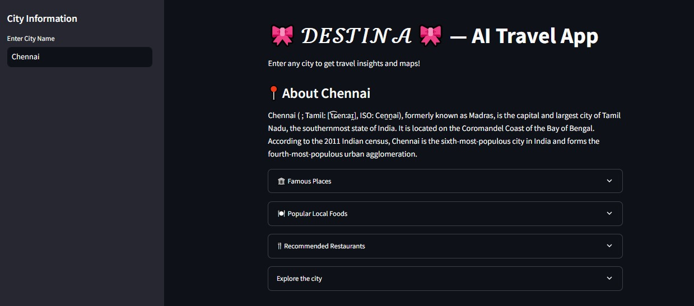
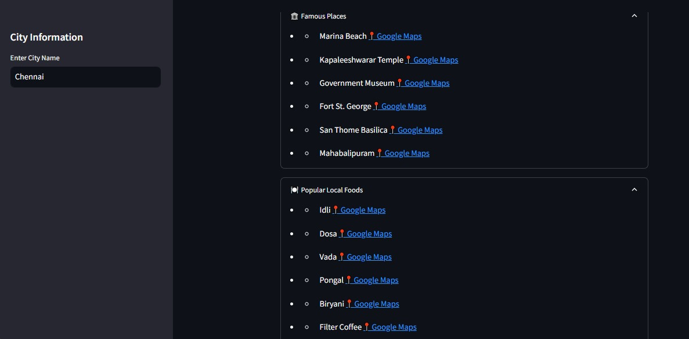
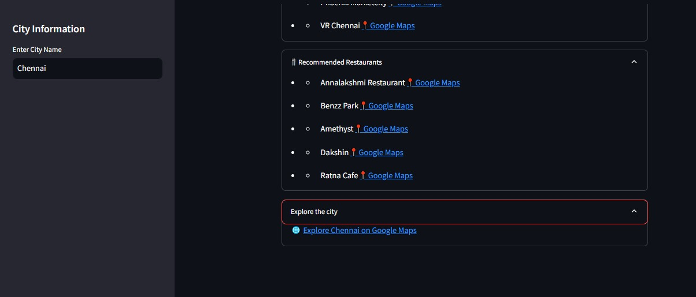
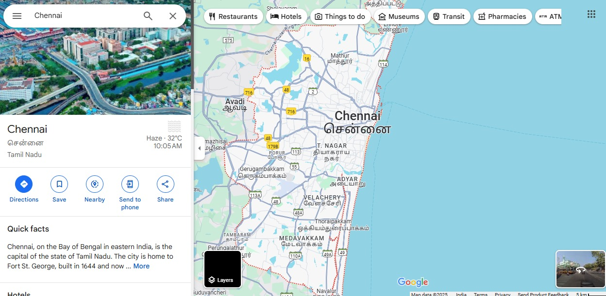

#  Destina - Your AI Travel Companion

Destina is an AI-powered travel guide that helps you explore destinations worldwide. Get instant insights about cities, famous places, local foods, malls, and restaurants, all in one place!

## 🚀 Features
- **City Information**: Get a brief description of any city from Wikipedia.
- **AI-Powered Travel Recommendations**: Receive suggestions on places to visit, foods to try, malls, and restaurants using Google's Gemini AI.
- **Google Maps Integration**: Quick access to location links for better navigation.
- **User-Friendly Interface**: Built with Streamlit for a seamless user experience.

## 📸 Screenshots

### Home Page

### City Search Example

### Travel Recommendations

###  Map Assistsnce

##  Technologies Used
- **Python**
- **Streamlit** (for UI)
- **Wikipedia API** (for city descriptions)
- **Google Gemini AI** (for travel recommendations)
- **Google Maps API** (for location links)

##  Deployment
To deploy Destina on a cloud platform, you can use **Streamlit Cloud**, **Render**, or **Heroku**.
